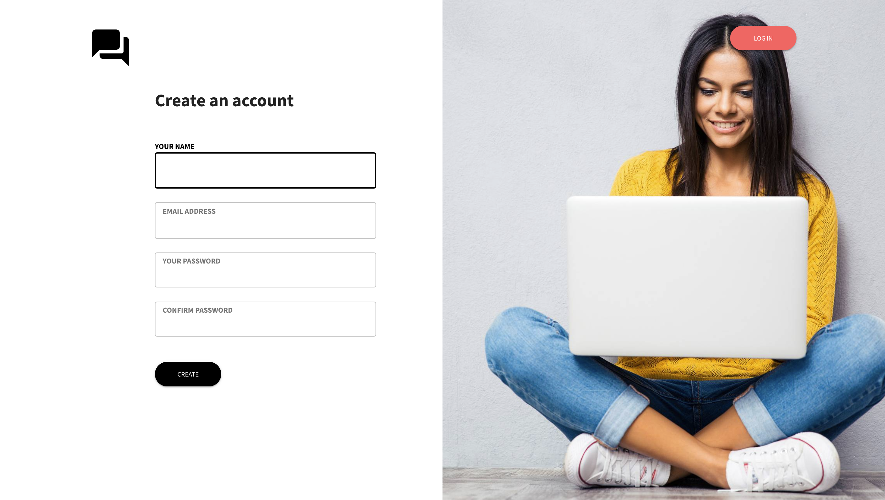
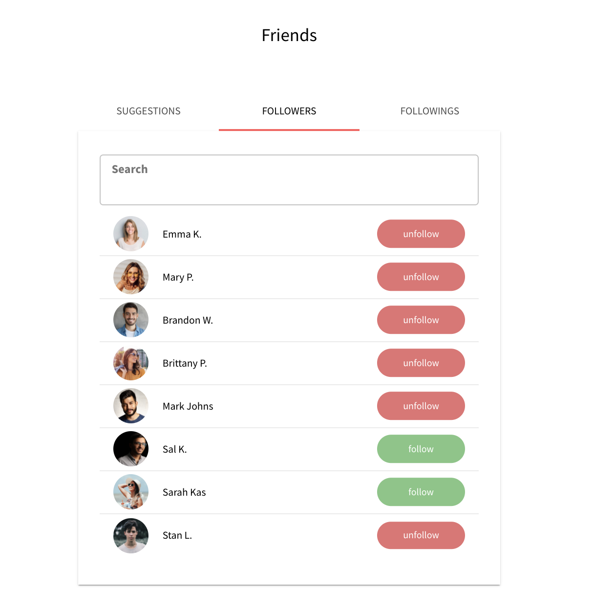
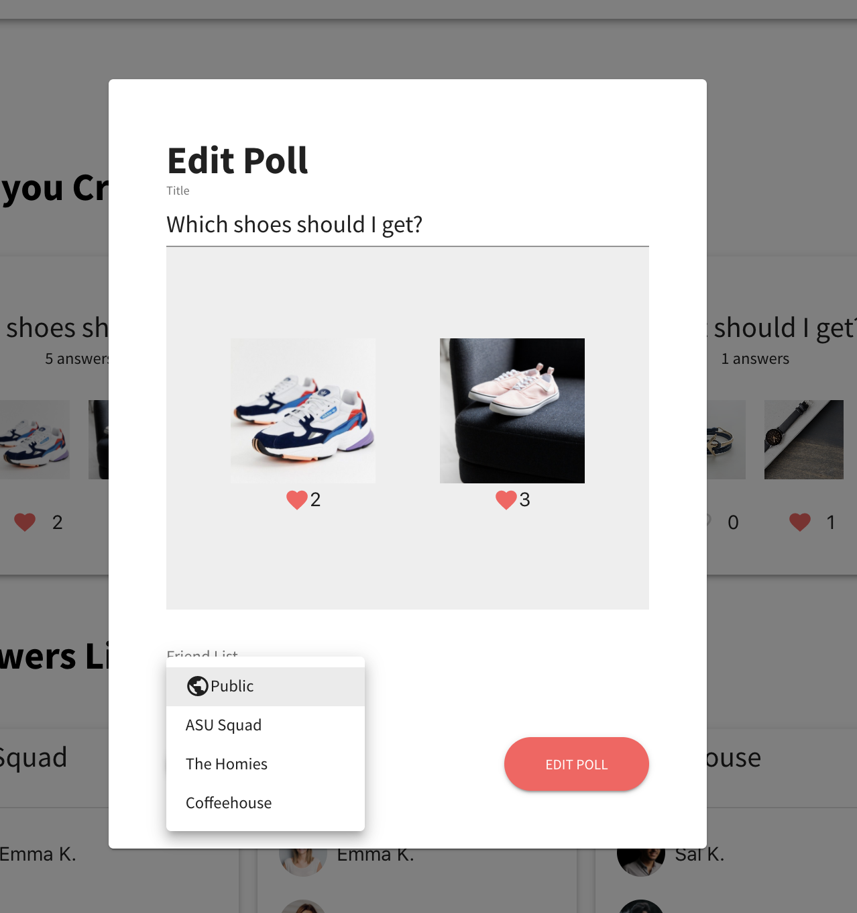

# Poll App. Hatchways Project

## Background and Overview

This app allows users to upload polls with two photos, and ask friends from friend lists, or the general public to vote on their polls.

---

## Setup

1. `cd` to `./server`
   1. Make sure MongoDB is setup and running on your localhost on port 27017. The app will connect to "poll" database on your local mongo connection.
   2. `yarn install`
   3. `yarn dev`

In a new terminal tab:

2. `cd` to `./client`

   1. `yarn install`
   2. `yarn start`

3. [optional] if you want to test out uplodaing photos, go to .env file and enter the following credentials with keys:

```
AWS_SECRET_ACCESS_KEY = ""
AWS_ACCESS_KEY_ID = ""
```

---

## Technology

### Stack

- Database
  - MongoDB
- Backend
  - Express, Mongoose
- Frontend
  - React (with hooks), Material UI

### Noticeable Dependencies

Backend:

- `socket.io`
  - For establishing web socket connections to update active/inactive user status
- `aws-sdk`, `multer`, `multer-s3`
  - For parsing uploaded images and sending them AWS S3
- `chai`, `mocha`, `mongodb-memory-server`
  - For integration testing

Frontend:

- `socket.io-client`
- `@material-ui/core`, `@material-ui/icons`, `@material-ui/tabs`
- `react-dropzone`

---

## API Endpoints

Checkout the [dev README](./dev.README.md) for details about API endpoints.

---

## App Images




<br/>

<br/>

<br/>

<br/>

<br/>


---

## Noticeable Features

### Feature Overview

- Web sockets
- Mobile responsiveness
- Integration testing
- React context

---

## Contributors

[Dhruv Arora](https://github.com/dotslash227), [Thiago Nemecek](https://github.com/tgnemecek), [Abdulhakeem Almidan](https://github.com/Hakeemmidan)
